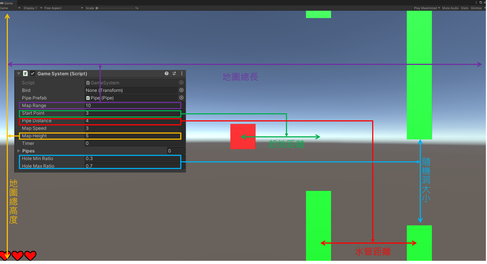
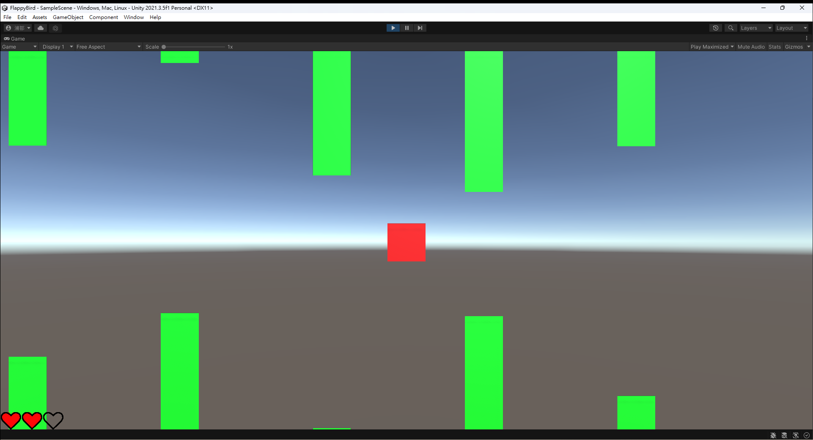
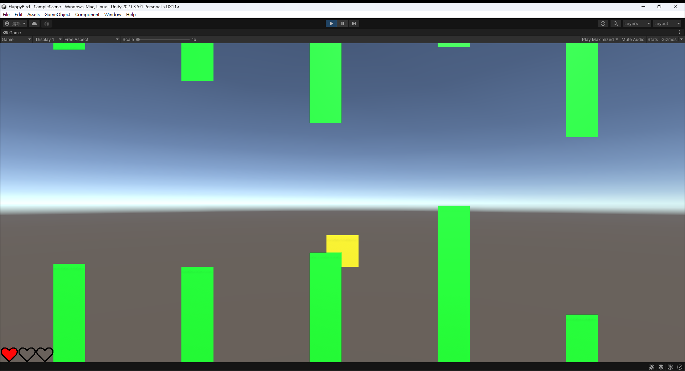

# FlappyBird
 
此專案為某次公司面試現場製作，於面試的半小時完成了 50% 後，後來又花了一個多小時把它完成。

裡面呈現了一些我在開發 Unity 時的編程習慣與技巧運用。


## 地圖細節設定

透過參數調整地圖細節，以後可透過這些參數動態調整難度！



1. `Map Range`: 地圖總長，讓玩家可視最遠的水管範圍。
2. `Start Point`: 當遊戲開始時，水管距離玩家的距離。
3. `Pipe Distance`: 水管間的距離。
4. `Map Speed`: 地圖移動速度，也是小鳥的移動速度。
5. `Map Height`: 地圖總高度，也是水管洞的隨機生成範圍。
6. `Hole Ratio`: 有分 Max 和 Min，並且是以 `Map Height` 的比例設定，設定 Max 和 Min 的用意在於隨機取其中的值來達到隨機性。

## 水管生成與隨機性

我採用了 `Objects Pool` 的概念使得水管可以重複力量，並在重新定位時調整隨機的洞口位置與寬度。



## 碰撞偵測

我採用 `RighidBody + Trigger` 的機制來偵測 Bird 與水管的碰撞。



當碰撞後會啟動保護機制，鳥會變成黃色三秒，並且後續不會碰撞將不予理會，直到三秒過後保護結束，顏色將變回紅色。

## 控制設定

本遊戲採用按下 `Space` 鍵就可跳躍的機制。並且本專案覺得使用 `RigidBody` 控制並無必要，因此是透過直接改變 `transform.position` 來做到跳躍與落下的動畫。
 
``` C#
void ControlY()
{
    var position = transform.position;
    ySpeed += -9.8f * Time.deltaTime;

    if (Input.GetKeyDown(KeyCode.Space))
    {
        ySpeed = jumpForce;
    }

    position.y += ySpeed * Time.deltaTime;

    if (position.y < -GameSystem.instance.mapHeight)
    {
        position.y = -GameSystem.instance.mapHeight;
        DetectHurt();
    }
    else if (position.y > GameSystem.instance.mapHeight)
    {
        position.y = GameSystem.instance.mapHeight;
        DetectHurt();
    }
    transform.position = position;
}
```

